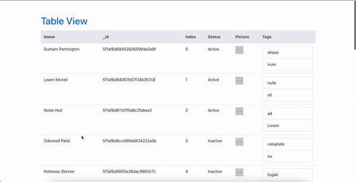

# Table Pagination
The bypass proxy server runs on port 3001, navigate to this project and run `npm run devStart`.  
The frontend app runs on port 3000, navigate to this project and run `npm run start`.  
 
